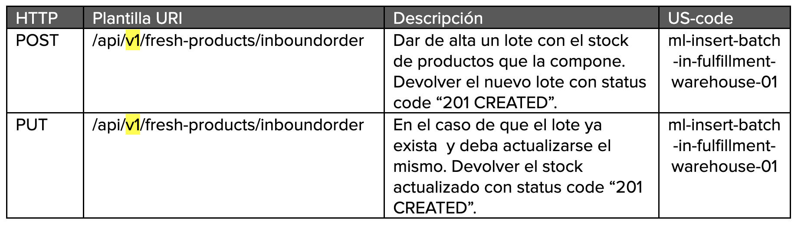

# MERCADO LIBRE - FRESCOS

Mercado libre esta implementando una nueva forma de negocio expandiendose hacia la zona de mercado especificamente los productos frescos (de refrigeracion) para esto se plantea la siguiente API que brinda una solucion a la nueva funcionalidad que quiere implementar Mercado Libre.

### Objetivo
El objetivo de este proyecto final es implementar una API REST en el marco de la consigna y aplicando los contenidos trabajados durante el BOOTCAMP MELI. (Git, Java, Spring, Bases de datos y calidad de software).

## Tools
- [Fury](https://web.furycloud.io/) -  Gestor de deploys de Mercado Libre
- [Java 11](https://www.java.com/es/) - Lenguaje de programacion.
- [Maven](https://maven.apache.org/) - Gestión de dependencias
- [MySql](https://www.mysql.com/) - Gestor de base de datos
- [Spring](https://spring.io/) - Java Framework

## Recursos - END POINTS
### US 0001: 
Ingresar un lote de productos a warehouse de fulfillment para registrar la existencia de stock.

Historia de usuario:

Metodos:

Request:

Response:

### US 0002:

Registrar Venta: Agregar producto al carrito de compras

Historia de usuario:

Metodos:

Request:

Response:

### US 0003:

Consultar ubicación de un producto en el warehouse

Historia de usuario:

Metodos:

Response:

### US 0004:

Consultar el stock de un producto en todos los warehouses

Historia de usuario:

Metodos:

Response:

### US 0005:

Consultar fecha de vencimiento por lote

Historia de usuario:

Metodos:

Response:

## Acknowledgements

 - [Digital House](https://www.digitalhouse.com/)
 - El equipo de Playground por su apoyo en cada pregunta e inconveniente que se nos presentó durante la contrucción de esta API.
 - Johanna Tabella, por su orientación y guía durante la planeación y construcción de la API.
 - A todos aquellos compañeros que nos brindaron una mano cuando más la necesitamos.
## Authors
- Daniel Hernandez - [@dhernandezoy](https://www.github.com/dhernandezoy)
- Eduard Jimenez - [@edujimenez21](https://www.github.com/edujimenez21)
- Felipe Moreno - [@felmorenoo](https://www.github.com/felmorenoo)
- Felipe Valencia - [@felipevalenciameli](https://www.github.com/felipevalenciameli)
- John Bairon Cuervo - [@johncuervoa](https://www.github.com/johncuervoa)
- Juan Pablo Lopez - [@juanlopezmeli](https://www.github.com/juanlopezmeli)

